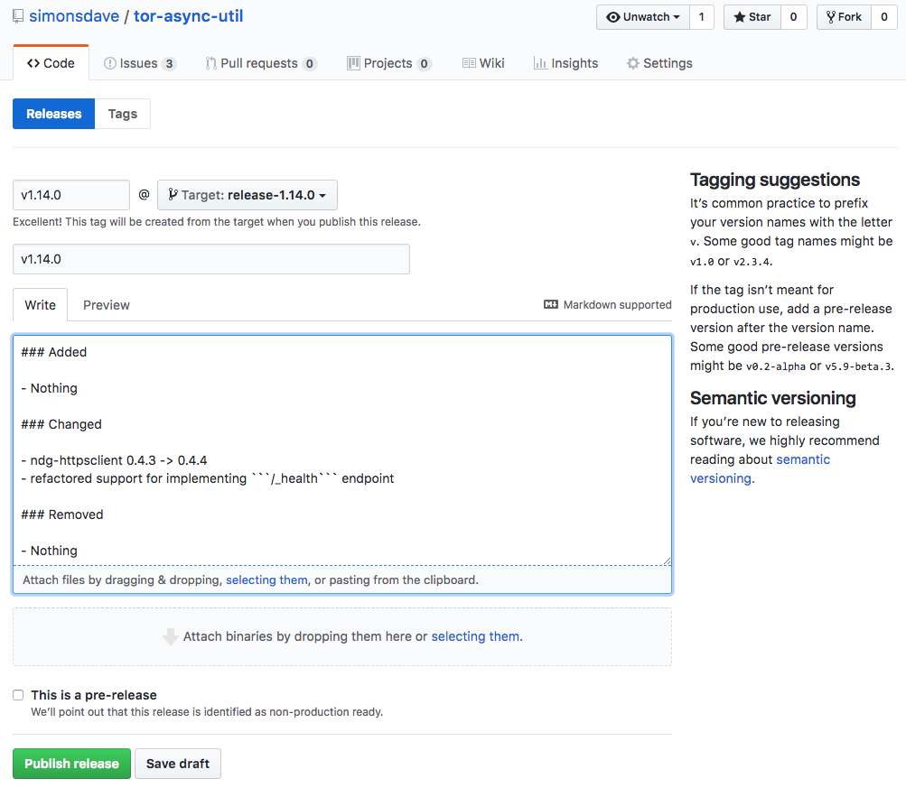

# Contributing

The following instructions describe how you can contribute
to this project.

## Getting Started

See [this](../dev_env) for details of how to configure a development environment
and get the automated tests working.

## CI

[Travis CI](https://www.travis-ci.org/) is used for CI.
As always, [```travis.yml```](../travis.yml) has all the Travis configuration.

## Branching and Versioning Strategy

* all development is done on the ```master``` branch
* we use [Semantic Versioning](http://semver.org/)
* for each release a new branch is created from master called ```release-<version>```

## How To Cut a Release

* this process leverages all the good work in from the [simonsdave / dev-env](https://github.com/simonsdave/dev-env) project
* the shell script ```prep-for-release-python.sh``` automates much of the release process
* make sure your ```~/.pypirc``` is setup

```bash
(env) ~/tor-async-util/> pip install ndg-httpsclient
```

```bash
(env) ~/tor-async-util> prep-for-release-python.sh
Already on 'master'
Your branch is up-to-date with 'origin/master'.
diff --git a/CHANGELOG.md b/CHANGELOG.md
index b7647f2..3375216 100644
--- a/CHANGELOG.md
+++ b/CHANGELOG.md
@@ -3,7 +3,7 @@ All notable changes to this project will be documented in this file.
 Format of this file follows [these](http://keepachangelog.com/) guidelines.
 This project adheres to [Semantic Versioning](http://semver.org/).

-## [%RELEASE_VERSION%] - [%RELEASE_DATE%]
+## [1.14.0] - [2018-02-19]

 ### Added

These changes to master for release look ok? (y/n)> y
```

```bash
[master 5a13633] 1.14.0 pre-release prep
 1 file changed, 1 insertion(+), 1 deletion(-)
/home/vagrant/tor-async-util/env/local/lib/python2.7/site-packages/pip/_vendor/requests/packages/urllib3/util/ssl_.py:318: SNIMissingWarning: An HTTPS request has been made, but the SNI (Subject Name Indication) extension to TLS is not available on this platform. This may cause the server to present an incorrect TLS certificate, which can cause validation failures. You can upgrade to a newer version of Python to solve this. For more information, see https://urllib3.readthedocs.io/en/latest/security.html#snimissingwarning.
  SNIMissingWarning
/home/vagrant/tor-async-util/env/local/lib/python2.7/site-packages/pip/_vendor/requests/packages/urllib3/util/ssl_.py:122: InsecurePlatformWarning: A true SSLContext object is not available. This prevents urllib3 from configuring SSL appropriately and may cause certain SSL connections to fail. You can upgrade to a newer version of Python to solve this. For more information, see https://urllib3.readthedocs.io/en/latest/security.html#insecureplatformwarning.
  InsecurePlatformWarning
diff --git a/CHANGELOG.md b/CHANGELOG.md
index 3375216..a92d5ff 100644
--- a/CHANGELOG.md
+++ b/CHANGELOG.md
@@ -3,6 +3,20 @@ All notable changes to this project will be documented in this file.
 Format of this file follows [these](http://keepachangelog.com/) guidelines.
 This project adheres to [Semantic Versioning](http://semver.org/).

+## [%RELEASE_VERSION%] - [%RELEASE_DATE%]
+
+### Added
+
+- Nothing
+
+### Changed
+
+- Nothing
+
+### Removed
+
+- Nothing
+
 ## [1.14.0] - [2018-02-19]

 ### Added
diff --git a/tor_async_util/__init__.py b/tor_async_util/__init__.py
index e6ff03c..77b2bf5 100644
--- a/tor_async_util/__init__.py
+++ b/tor_async_util/__init__.py
@@ -23,7 +23,7 @@ import tornado.web
 import jsonschemas


-__version__ = '1.14.0'
+__version__ = '1.15.0'


 _logger = logging.getLogger('tor_async_util')
These changes to master for next release look ok? (y/n)> y
```

```bash
[master cb1f315] Prep CHANGELOG.md for next release
 2 files changed, 15 insertions(+), 1 deletion(-)
Switched to branch 'release-1.14.0'
running bdist_wheel
running build
running build_py
copying tor_async_util/__init__.py -> build/lib.linux-x86_64-2.7/tor_async_util
running egg_info
writing requirements to tor_async_util.egg-info/requires.txt
writing tor_async_util.egg-info/PKG-INFO
writing top-level names to tor_async_util.egg-info/top_level.txt
writing dependency_links to tor_async_util.egg-info/dependency_links.txt
reading manifest file 'tor_async_util.egg-info/SOURCES.txt'
reading manifest template 'MANIFEST.in'
writing manifest file 'tor_async_util.egg-info/SOURCES.txt'
running build_scripts
installing to build/bdist.linux-x86_64/wheel
running install
running install_lib
creating build/bdist.linux-x86_64/wheel
creating build/bdist.linux-x86_64/wheel/tor_async_util
creating build/bdist.linux-x86_64/wheel/tor_async_util/jsonschemas
copying build/lib.linux-x86_64-2.7/tor_async_util/jsonschemas/get_health_response.json -> build/bdist.linux-x86_64/wheel/tor_async_util/jsonschemas
copying build/lib.linux-x86_64-2.7/tor_async_util/jsonschemas/get_noop_response.json -> build/bdist.linux-x86_64/wheel/tor_async_util/jsonschemas
copying build/lib.linux-x86_64-2.7/tor_async_util/jsonschemas/get_version_response.json -> build/bdist.linux-x86_64/wheel/tor_async_util/jsonschemas
copying build/lib.linux-x86_64-2.7/tor_async_util/__init__.py -> build/bdist.linux-x86_64/wheel/tor_async_util
copying build/lib.linux-x86_64-2.7/tor_async_util/jsonschemas.py -> build/bdist.linux-x86_64/wheel/tor_async_util
running install_egg_info
Copying tor_async_util.egg-info to build/bdist.linux-x86_64/wheel/tor_async_util-1.14.0-py2.7.egg-info
running install_scripts
creating build/bdist.linux-x86_64/wheel/tor_async_util-1.14.0.data
creating build/bdist.linux-x86_64/wheel/tor_async_util-1.14.0.data/scripts
copying build/scripts-2.7/tor_async_util_nosetests.py -> build/bdist.linux-x86_64/wheel/tor_async_util-1.14.0.data/scripts
changing mode of build/bdist.linux-x86_64/wheel/tor_async_util-1.14.0.data/scripts/tor_async_util_nosetests.py to 775
creating build/bdist.linux-x86_64/wheel/tor_async_util-1.14.0.dist-info/WHEEL
creating '/home/vagrant/tor-async-util/dist/tor_async_util-1.14.0-py2-none-any.whl' and adding '.' to it
adding 'tor_async_util/__init__.py'
adding 'tor_async_util/jsonschemas.py'
adding 'tor_async_util/jsonschemas/get_health_response.json'
adding 'tor_async_util/jsonschemas/get_noop_response.json'
adding 'tor_async_util/jsonschemas/get_version_response.json'
adding 'tor_async_util-1.14.0.data/scripts/tor_async_util_nosetests.py'
adding 'tor_async_util-1.14.0.dist-info/DESCRIPTION.rst'
adding 'tor_async_util-1.14.0.dist-info/metadata.json'
adding 'tor_async_util-1.14.0.dist-info/top_level.txt'
adding 'tor_async_util-1.14.0.dist-info/WHEEL'
adding 'tor_async_util-1.14.0.dist-info/METADATA'
adding 'tor_async_util-1.14.0.dist-info/RECORD'
running sdist
running check
creating tor_async_util-1.14.0
creating tor_async_util-1.14.0/bin
creating tor_async_util-1.14.0/tor_async_util
creating tor_async_util-1.14.0/tor_async_util.egg-info
creating tor_async_util-1.14.0/tor_async_util/jsonschemas
copying files to tor_async_util-1.14.0...
copying MANIFEST.in -> tor_async_util-1.14.0
copying README.md -> tor_async_util-1.14.0
copying README.rst -> tor_async_util-1.14.0
copying setup.cfg -> tor_async_util-1.14.0
copying setup.py -> tor_async_util-1.14.0
copying bin/tor_async_util_nosetests.py -> tor_async_util-1.14.0/bin
copying tor_async_util/__init__.py -> tor_async_util-1.14.0/tor_async_util
copying tor_async_util/jsonschemas.py -> tor_async_util-1.14.0/tor_async_util
copying tor_async_util.egg-info/PKG-INFO -> tor_async_util-1.14.0/tor_async_util.egg-info
copying tor_async_util.egg-info/SOURCES.txt -> tor_async_util-1.14.0/tor_async_util.egg-info
copying tor_async_util.egg-info/dependency_links.txt -> tor_async_util-1.14.0/tor_async_util.egg-info
copying tor_async_util.egg-info/requires.txt -> tor_async_util-1.14.0/tor_async_util.egg-info
copying tor_async_util.egg-info/top_level.txt -> tor_async_util-1.14.0/tor_async_util.egg-info
copying tor_async_util/jsonschemas/get_health_response.json -> tor_async_util-1.14.0/tor_async_util/jsonschemas
copying tor_async_util/jsonschemas/get_noop_response.json -> tor_async_util-1.14.0/tor_async_util/jsonschemas
copying tor_async_util/jsonschemas/get_version_response.json -> tor_async_util-1.14.0/tor_async_util/jsonschemas
Writing tor_async_util-1.14.0/setup.cfg
Creating tar archive
removing 'tor_async_util-1.14.0' (and everything under it)
diff --git a/README.md b/README.md
index 985f133..0131f7a 100644
--- a/README.md
+++ b/README.md
@@ -4,9 +4,9 @@
 
 
 [](https://pypi.python.org/pypi/tor-async-util)
-[](https://requires.io/github/simonsdave/tor-async-util/requirements/?br
-[](https://travis-ci.org/simonsdave/tor-async-util)
-[](https://coveralls.io/github/simonsdave/tor-async-util?branch=mast
+[](https://requires.io/github/simonsdave/tor-async-util/requirem
+[](https://travis-ci.org/simonsdave/tor-async-util)
+[](https://coveralls.io/github/simonsdave/tor-async-util?bra

 tor-async-util is a set of utilities that are useful
 when implementing RESTful APIs using [Tornado's](http://www.tornadoweb.org/en/stable/)
These changes to release-1.14.0 look ok? (y/n)> y
```

```bash
[release-1.14.0 a75e245] 1.14.0 release prep
 1 file changed, 3 insertions(+), 3 deletions(-)
All changes made locally. Ok to push changes to github? (y/n)> y
```

```bash
Switched to branch 'master'
Your branch is ahead of 'origin/master' by 2 commits.
  (use "git push" to publish your local commits)
Counting objects: 48, done.
Compressing objects: 100% (8/8), done.
Writing objects: 100% (8/8), 731 bytes | 0 bytes/s, done.
Total 8 (delta 6), reused 0 (delta 0)
remote: Resolving deltas: 100% (6/6), completed with 4 local objects.
To git@github.com:simonsdave/tor-async-util.git
   bb51cd9..cb1f315  master -> master
Switched to branch 'release-1.14.0'
Counting objects: 21, done.
Compressing objects: 100% (3/3), done.
Writing objects: 100% (3/3), 363 bytes | 0 bytes/s, done.
Total 3 (delta 2), reused 0 (delta 0)
remote: Resolving deltas: 100% (2/2), completed with 2 local objects.
To git@github.com:simonsdave/tor-async-util.git
 * [new branch]      release-1.14.0 -> release-1.14.0
Switched to branch 'master'
Your branch is up-to-date with 'origin/master'.
(env) ~/tor-async-util>
```

```bash
(env) ~/tor-async-util> twine upload dist/* -r testpypi
Uploading distributions to https://test.pypi.org/legacy/
Uploading tor_async_util-1.14.0-py2-none-any.whl
Uploading tor_async_util-1.14.0.tar.gz
(env) ~/tor-async-util>
```

Now look on [https://test.pypi.org/project/tor-async-util/](https://test.pypi.org/project/tor-async-util/)
to confirm all is ok and if it is upload to the test version of pypi.

```bash
(env) ~/tor-async-util> twine upload dist/*
Uploading distributions to https://upload.pypi.org/legacy/
Uploading tor_async_util-1.14.0-py2-none-any.whl
Uploading tor_async_util-1.14.0.tar.gz
(env) ~/tor-async-util>
```

Now look on [https://pypi.org/project/tor-async-util/](https://pypi.org/project/tor-async-util/)
to confirm all is ok and if it is upload to the production version of pypi.

```bash
(env) ~/tor-async-util> cd dist/
(env) ~/tor-async-util/dist> cp * /vagrant/.
(env) ~/tor-async-util/dist> ls -la /vagrant/tor_async_util*
-rw-r--r-- 1 vagrant vagrant 18122 Feb 19 19:47 /vagrant/tor_async_util-1.14.0-py2-none-any.whl
-rw-r--r-- 1 vagrant vagrant 16131 Feb 19 19:47 /vagrant/tor_async_util-1.14.0.tar.gz
(env) ~/tor-async-util>
```

* on the [releases](https://github.com/simonsdave/tor-async-util/releases)
page hit the <Draft a new release> button in the upper right corner
* fill out the release form as per the screenshot below
* main body of the form can be pulled directly from [CHANGELOG.md](../CHANGELOG.md)
* don't forget to attach to the release the ```tor_async_util-*.whl``` and ```tor_async_util-*.tar.gz```
copied to ```/vagrant``` in one of the above steps


